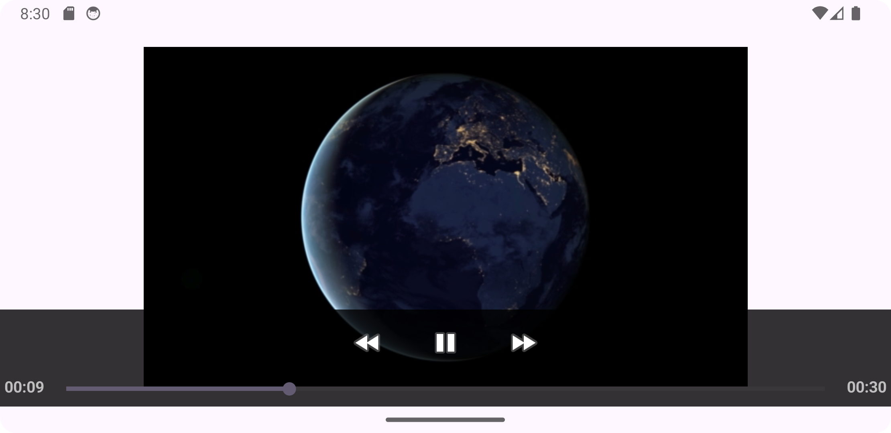

# 🎬 Create the Player 🎬

Create a video player that plays video files. Assignment in the Meta Android Developer Professional Certification Course

Show some ❤️ and star ⭐ the repo if you liked it.

###### contact for work, mail: chunhthanhde.dev@gmail.com


<a href="https://www.linkedin.com/in/chunhthanhde/">

</a>

<a href="https://www.buymeacoffee.com/chunhthanhde" target="_blank"></a>

## 🎯 Lab Objectives 🎯

**Goal:**

Create a video player that plays a video file.



**Objectives:**

1. Create an Android project.
2. Add an mp4 video file to your new project.
3. Create a user interface.
4. Add `import` statements `VideoView` and `MediaController` to your `Activity` class.
5. Add a `VideoView` to `activity_main.xml`.
6. Add the code that plays the video in the `onCreate()` function of `MainActivity.kt`.

## 📝 Exercise Instructions 📝

Following this reading exercise, you should be able to create a simple player app.

1. **Create an Android project:** Start by creating a new Android project in your preferred development environment.

2. **Add an mp4 video file:** Add an mp4 video file to your new project. You can either use an existing video file or download one from the internet.

3. **Create a user interface:** Design the user interface for your video player app. This can include a `VideoView` to display the video, and any necessary controls (e.g., play, pause, stop) that you want to add.

4. **Import necessary classes:** In your `MainActivity.kt` file, add the following `import` statements at the top of the file:

   ```kotlin
   import android.net.Uri
   import android.os.Bundle
   import android.widget.MediaController
   import android.widget.VideoView
   ```

5. **Add a `VideoView` to `activity_main.xml`:** In your `activity_main.xml` file, add a `VideoView` to the layout:

   ```xml
    <VideoView
        android:id="@+id/testView"
        android:layout_width="wrap_content"
        android:layout_height="308dp"
        app:layout_constraintBottom_toBottomOf="parent"
        app:layout_constraintEnd_toEndOf="parent"
        app:layout_constraintStart_toStartOf="parent"
        app:layout_constraintTop_toTopOf="parent" />
   ```

6. **Play the video in `onCreate()`:** In your `MainActivity.kt` file, add the following code to the `onCreate()` function:

   ```kotlin
   override fun onCreate(savedInstanceState: Bundle?) {
        super.onCreate(savedInstanceState)

        binding = ActivityMainBinding.inflate(layoutInflater)
        setContentView(binding.root)

        //Find the VideoView class by its id
        val videoView = findViewById<VideoView>(binding.testView.id)
        //Creating MediaController
        val mediaController = MediaController(this)
        mediaController.setAnchorView(videoView)
        //specify the location of media file
        val uri: Uri = parse(
            "android.resource://" + packageName
                    + "/raw/raw"
        )
        //Setting MediaController and URI, then starting the videoView
        videoView.setMediaController(mediaController)
        videoView.setVideoURI(uri)
        videoView.requestFocus()
        videoView.start()
   }
   ```

   Replace `your_video_file_name` with the name of your video file (e.g., `sample_video.mp4`).

That's it! You have now created a simple video player app that can play an mp4 video file. You can further customize the app by adding additional features, such as controls to pause, rewind, or fast-forward the video.
